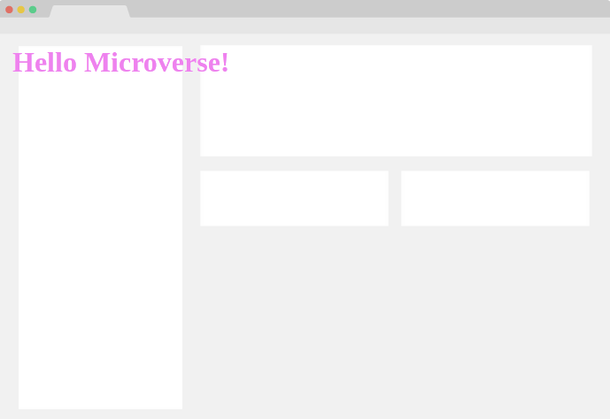

# Hello Microverse

> This project is dedicated to microverse. It is a task to develope knowledge about github ,githubflow ,
setting up linter and ignore files using .gitignore

This project contains, linter testings and a html file that contains a header "Hello world" designed through styles.css

## Built With

- HTML
- CSS

## Live Demo

[Live Demo Link](https://aminehlub.github.io/Hello-Microverse/)

## Getting Started

### Prerequisites

- Internet Connection

- OS with Git installed on it

### Setup

**Run** git clone https://github.com/AmineHLub/Hello-Microverse.git

### Install

no installation required

### Usage

for testing only (index.html)

### Run tests

**Run** index.html

## Author

👤 **Author**

- GitHub: [@AmineHLub](https://github.com/AmineHLub)
- Twitter: [@Amino47612441](https://twitter.com/Amino47612441)
- LinkedIn: [LinkedIn](https://www.linkedin.com/in/mohamed-amine-hajltaief-b18863163/)

## 🤝 Contributing

Contributions, issues, and feature requests are welcome!

Feel free to check the [issues page](../../issues/).

## Acknowledgments

- Hat tip to anyone whose code was used
- Inspiration
- etc

## 📝 License

This project is [MIT](./MIT.md) licensed.
